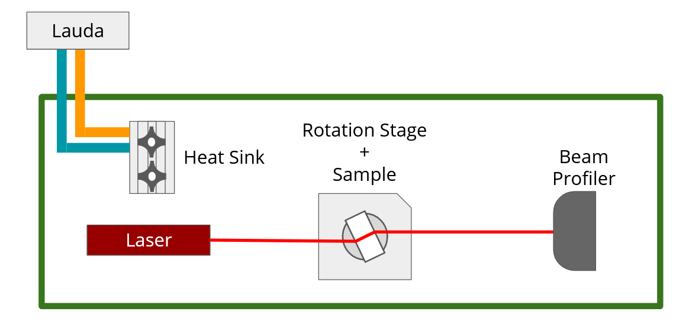

## Index of Refraction Measurement Setup

This repo includes a collection of tools in Python to measure the index of refraction of a material as described in [1].We are using the following pieces of equipment:

- **ESP301 Newport Motion Controller**: For controlling the rotation stage precisely
- **Thorlabs Beam Profiler BP209-VIS/M**: For measuring the center of the beam (as opposed to the knife edge technique)

I have written two custom libraries to interface with these devices in Python, which can be found in the `ESP301Control` and `TLBP2Control` directories respectively. These are also available in their own repos, including more information about how to utilize them/how they are constructed.

The basic idea of the experiment is to measure the displacement of a laser as a function of it's incident angle on a sample.



### Dependencies

To get the code running properly, you will need to install the following things.

- Python 3.8 (must be 64-bit)
	- The following packages from pip: `pythonnet`, `tinkerforge`, `pywin32`
- [ThorLabs Beam Profiler Software](https://www.thorlabs.com/software_pages/ViewSoftwarePage.cfm?Code=Beam)
- [ESP301 Motion Controller Software](https://www.newport.com/p/ESP301-3N)
	- You will also need to install the driver from `C:\Newport\Motion Control\ESP301\Bin\USB Driver\`
- [x86 **and** x64 .NET Desktop Runtime 3.1](https://dotnet.microsoft.com/download/dotnet/3.1) (very important that you have both)
- [Tinkerforge brickdaemon](https://www.tinkerforge.com/en/doc/Downloads.html)

### Usage

I would highly recommend using the initialization walkthrough when setting up the experiment:

```
python Initialization.py
```

This will check whether all of the proper libraries are installed, if all of the instruments are working correctly, and give advice on how to rectify any issues.

It would also be a good idea to verify that the values for ports/identifiers in the `Settings.py` file are applicable for your machine (though this is covered in the initialization process).

See the `BeamTracking` notebook for an example of how to collect data, and either the `CurveFitting` or `AdvancedCurveFitting` notebooks for examples of how to analyze this data to extract the refractive index.

### References

[1] Nemoto, S. (1992). Measurement of the refractive index of liquid using laser beam displacement. Applied optics, 31 31, 6690-4 .
